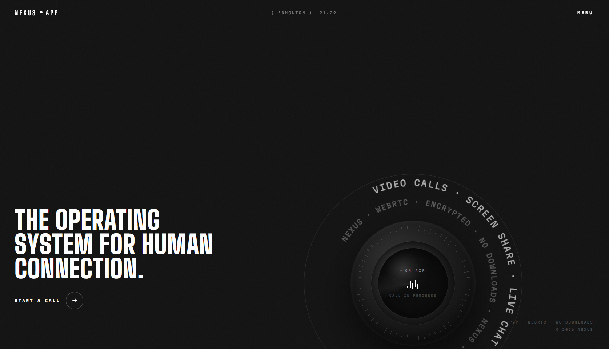
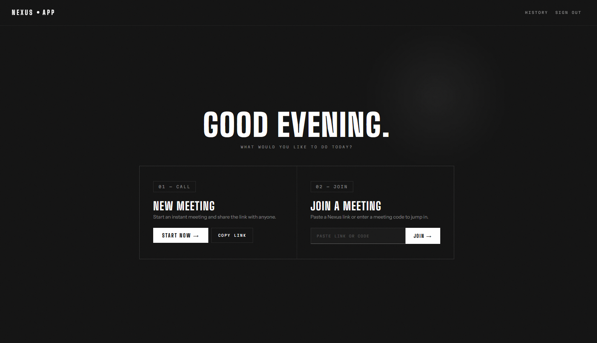
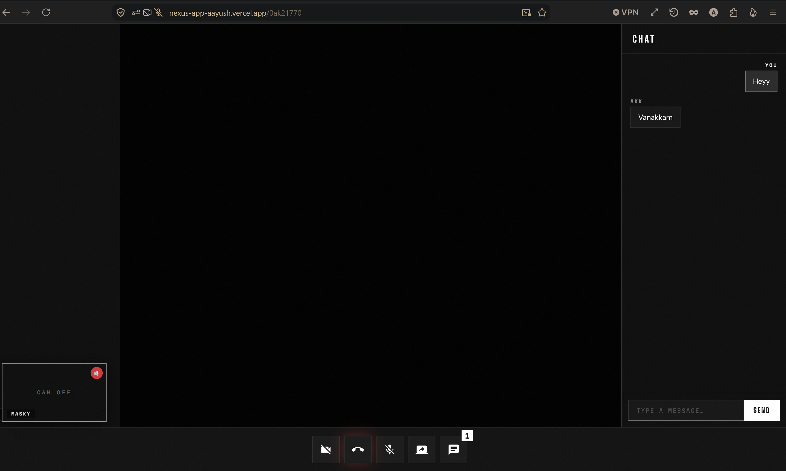

# Nexus — Video Calls, Reimagined

> Real-time video conferencing built with WebRTC, Socket.IO, React, and Node.js.

**[Live Demo](https://nexus-app-aayush.vercel.app)** · **[GitHub](https://github.com/Aayush-Karthikeyan/Nexus)**

---

## Demo

[](https://youtu.be/zn1L-Hs3vCQ)

Watch the 90-second demo on YouTube.

**Try it live:** [https://nexus-app-aayush.vercel.app](https://nexus-app-aayush.vercel.app)

---

## Overview

Nexus is a full-stack video-conferencing application that lets users start instant meetings, share invitation links, and communicate through live chat—all in the browser with no downloads required.

I built Nexus to understand real-time browser communication at the protocol level, including WebRTC peer connections, SDP offer/answer exchange, ICE candidate negotiation, and Socket.IO-based signaling.

## Screenshots

**Landing page**



**Dashboard — start or join a meeting**



**In a call — controls and live chat**



## Features

- **WebRTC video calls** — direct peer-to-peer media when possible, with TURN relay fallback
- **Real-time chat** — participant messages delivered through Socket.IO
- **Screen sharing** — share a browser tab, application window, or display
- **Participant name badges** — identify each person on their video tile
- **Camera and microphone controls** — toggle media with clear visual indicators
- **Meeting history** — save previous meeting codes for registered users
- **Guest access** — join meetings without creating an account
- **Shareable meeting links** — create and copy invitation links in one click
- **User authentication** — register and sign in with bcrypt-hashed passwords

## Tech Stack

| Layer | Technology |
|---|---|
| Frontend | React 18, React Router 6, Material UI |
| Real-time communication | WebRTC (`RTCPeerConnection`), Socket.IO 4 |
| NAT traversal | Google STUN, managed Metered TURN with backend-issued short-lived credentials |
| Backend | Node.js, Express 4 |
| Database | MongoDB Atlas, Mongoose |
| Authentication | bcrypt password hashing, opaque server-issued tokens |
| Deployment | Vercel, Render, MongoDB Atlas |
| Fonts | Bebas Neue, Space Grotesk |

## Architecture

```text
Browser A                    Socket.IO Server                    Browser B
   |                         (Node + Express)                       |
   |── join-call ─────────────────►|                                |
   |                               |◄────────────────── join-call ──|
   |◄──────────── user-joined ─────|────── user-joined ────────────►|
   |                               |                                |
   |── SDP offer ─────────────────►|───────────────────────────────►|
   |◄──────────────────────────────|◄────────────────── SDP answer ─|
   |── ICE candidates ────────────►|───────────────────────────────►|
   |◄──────────────────────────────|◄────────────── ICE candidates ─|
   |                               |                                |
   |── chat message ──────────────►|────────────── chat message ───►|

Media path selected by WebRTC:

Browser A ◄══════════ direct peer-to-peer media ══════════► Browser B

                         or, when required

Browser A ◄════════► TURN relay ◄════════► Browser B
```

The Socket.IO server manages room membership, signaling, participant events, and chat. Video and audio use WebRTC: media travels directly between browsers when possible and falls back to a TURN relay when a direct connection cannot be established. The application server does not process the media stream itself.

## How WebRTC Works

1. **Media capture** — the browser requests access to the user’s camera and microphone through `getUserMedia()`.
2. **Signaling** — peers exchange SDP offers, SDP answers, and ICE candidates through the Socket.IO server.
3. **ICE negotiation** — WebRTC gathers possible network paths using STUN and, when necessary, TURN.
4. **Connection** — each browser tests the available candidates and selects a working route.
5. **Streaming** — media flows directly between peers when possible or through a TURN relay when required.

## Running Locally

### Prerequisites

- Node.js 18+
- A MongoDB Atlas database or local MongoDB instance

### 1. Clone the repository

```bash
git clone https://github.com/Aayush-Karthikeyan/Nexus.git
cd Nexus
```

### 2. Start the backend

From the repository root:

```bash
cd backend
npm install
```

Create `backend/.env` (see `backend/.env.example`):

```env
MONGO_URI=your_mongodb_connection_string
PORT=8000

# Managed Metered TURN — required for reliable cross-network calls
METERED_DOMAIN=yourappname.metered.live
METERED_SECRET_KEY=your_metered_secret_key
```

| Variable | Required | Purpose |
|---|---|---|
| `MONGO_URI` | Yes | MongoDB connection string for users and meeting history |
| `PORT` | No | Server port; defaults to `8000` |
| `METERED_DOMAIN` | For cross-network calls | Your Metered app host, e.g. `yourappname.metered.live` |
| `METERED_SECRET_KEY` | For cross-network calls | Metered secret key, used **server-side only** |

The two `METERED_*` values stay on the server. The backend exchanges them for
short-lived TURN credentials and serves those to the browser via
`GET /api/turn-credentials`; the secret key is never sent to the client or
included in the frontend bundle.

Without them the app still runs, but falls back to STUN-only. Calls between
peers on the same network keep working, while calls across different networks
(for example Wi-Fi to cellular) will usually fail to connect.

Start the development server:

```bash
npm run dev
```

The backend runs at `http://localhost:8000`.

### 3. Start the frontend

Open a second terminal at the repository root:

```bash
cd frontend
npm install
npm start
```

The frontend runs at `http://localhost:3000` and uses `http://localhost:8000` as its default local backend.

For a deployed frontend, set `REACT_APP_BACKEND_URL` to the deployed backend URL.

## Deployment

- **Frontend** — deployed on Vercel with `REACT_APP_BACKEND_URL` pointing to the Render backend
- **Backend** — deployed on Render with `MONGO_URI`, `METERED_DOMAIN`, and `METERED_SECRET_KEY` configured in the environment. `PORT` is supplied by Render.
- **Database** — hosted on MongoDB Atlas

The `METERED_*` values must be set as backend environment variables only. Never
place them in a `REACT_APP_*` variable — Create React App inlines those into the
public JavaScript bundle.

## Project Structure

```text
Nexus/
├── backend/
│   └── src/
│       ├── app.js                  # Express and Socket.IO server setup
│       ├── controllers/
│       │   ├── socketManager.js    # Signaling, chat, and room management
│       │   └── user.controller.js  # Registration, login, and history
│       ├── models/
│       │   ├── user.model.js
│       │   └── meeting.model.js
│       └── routes/
│           └── users.routes.js
└── frontend/
    └── src/
        ├── pages/
        │   ├── landing.jsx         # Landing page
        │   ├── home.jsx            # Start or join a meeting
        │   ├── VideoMeet.jsx       # Core video-call interface
        │   ├── authentication.jsx  # Registration and login
        │   └── history.jsx         # Previous meetings
        ├── contexts/
        │   └── AuthContext.jsx     # Authentication state and API calls
        └── styles/
            └── videoComponent.module.css
```

## Known Limitations

- **TURN free-tier quota** — relay traffic runs on Metered's free tier, which caps monthly TURN bandwidth. Only calls that cannot connect directly consume it, but a busy deployment would need a paid plan or a self-hosted TURN server.
- **STUN-only fallback** — if TURN credentials cannot be retrieved, the app falls back to Google STUN and reports the degraded state in the call UI. Same-network calls still connect; cross-network calls usually will not.
- **Mesh topology** — every participant connects to every other participant, so the current architecture is best suited to small meetings. Larger rooms would require an SFU such as mediasoup or LiveKit.
- **In-memory room state** — active connections and chat messages are held in server memory and are lost when the backend restarts.
- **Free-tier cold starts** — the Render backend may take approximately 30–60 seconds to wake after a period of inactivity.

## What I Learned

- How the complete WebRTC signaling flow works, including SDP offer/answer exchange and ICE candidate negotiation
- Why peer-to-peer communication still requires a signaling channel
- How STUN discovers network routes and TURN relays media when direct connectivity fails
- How to manage Socket.IO rooms, participant events, and real-time chat
- How React refs preserve peer connections, sockets, and media streams across renders
- Why mesh WebRTC architectures work for small rooms but require an SFU to scale

## Author

**Aayush Karthikeyan**

[GitHub](https://github.com/Aayush-Karthikeyan) · [LinkedIn](https://www.linkedin.com/in/aayushkarthikeyan-pythu/)

---

*Deployed with Vercel, Render, and MongoDB Atlas.*
